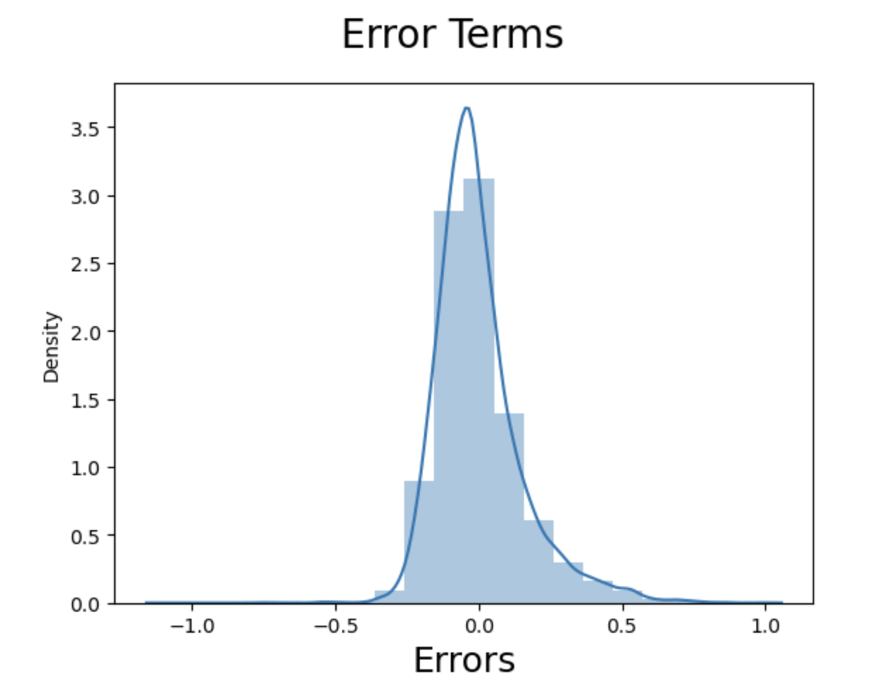
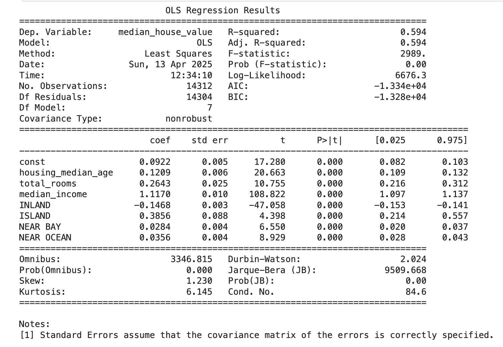
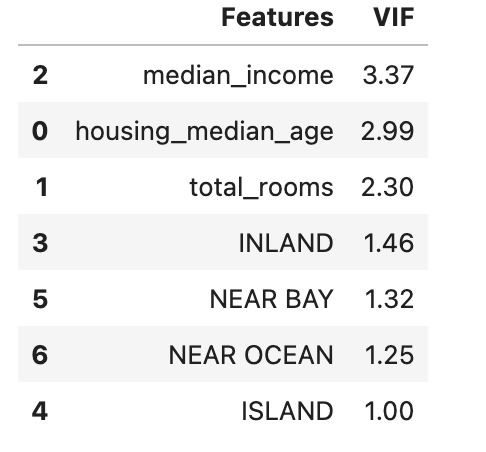

# Multiple Linear Regression

In this project, I analyzed housing data using Python libraries: **NumPy**, **Pandas**, and **sklearn**.

### Steps and Analysis:

1. **Data Preprocessing:**
   - Converted categorical data (e.g., ocean proximity) to dummy variables.
   - Scaled numeric data using `MinMaxScaler` to normalize the range of features.

2. **Feature Selection:**
   - The target variable was the **median house value**.
   - Columns with a **Variance Inflation Factor (VIF)** score greater than 5 were excluded to address multicollinearity.

3. **Model Evaluation:**
   - Verified that the error terms followed a normal distribution to validate the assumptions of linear regression.
   - Achieved R-squared values of **0.62** (training data) and **0.61** (testing data), indicating a moderate fit of the model.

### Libraries Used:
- NumPy
- Pandas
- sklearn
